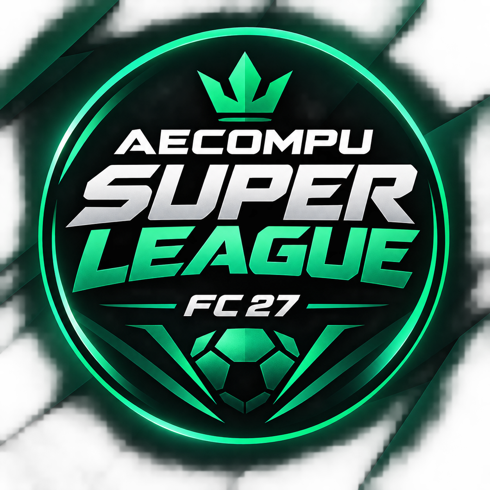

 

AECOMPU SUPERLEAGUE

FC 27 TOURNAMENT

Competencia universitaria de EA SPORTS FC 27 organizada por AECOMPU

 

 

Universidad Gerardo Barrios · Centro Regional Usulután

 

DOMINA EL CAMPO. CONQUISTA LA LIGA.

  

⚽ Sobre AECOMPU SuperLeague

AECOMPU SuperLeague es una landing page oficial diseñada para presentar, promocionar y gestionar visualmente un torneo universitario competitivo de FC 27.

El proyecto fue desarrollado con una identidad visual inspirada en transmisiones deportivas modernas, competiciones de eSports y eventos de fútbol digital, manteniendo una estética oscura, tecnológica y competitiva.

La plataforma está preparada para mostrar información del torneo como:

formato de competencia;

calendario;

partidos;

resultados;

clasificación;

bracket;

reglamento;

premios;

gran final;

inscripciones;

preguntas frecuentes;

información de AECOMPU.

La información que todavía no ha sido definida oficialmente utiliza el estado POR CONFIRMAR, evitando mostrar fechas, premios, jugadores o reglas inventadas.

🏆 Identidad del torneo

Información

Detalle

Nombre

AECOMPU SuperLeague

Juego

FC 27

Temporada

2026

Formato

1 VS 1

Modalidad

Presencial

Organizador

AECOMPU

Universidad

Universidad Gerardo Barrios

Sede

Centro Regional Usulután

Plataforma

Por confirmar

🎮 Experiencia visual

La interfaz utiliza una estética deportiva premium basada en:

fondos oscuros;

verde esmeralda;

verde neón moderado;

detalles en turquesa;

geometría deportiva;

polígonos;

diagonales;

líneas técnicas;

iluminación digital;

grids;

profundidad visual;

microinteracciones;

composición estilo broadcast;

elementos inspirados en competencias profesionales de eSports.

El objetivo visual del proyecto es que la página se perciba como el sitio oficial de una competición real y no como una plantilla universitaria tradicional.

✨ Características

Hero deportivo

La sección principal presenta:

identidad de AECOMPU SuperLeague;

FC 27 Tournament;

temporada;

formato 1 VS 1;

modalidad presencial;

llamadas a la acción;

composición geométrica;

número 27 como elemento visual;

wordmark de SuperLeague;

efectos de profundidad.

Match Center

Sistema visual para mostrar partidas:

CUARTOS DE FINAL

JUGADOR 01    2

      FINAL

JUGADOR 02    1

Los encuentros se administran directamente desde:

const matches = [];

Tournament Bracket

Bracket preparado para mostrar:

CUARTOS
   ↓
SEMIFINALES
   ↓
FINAL
   ↓
CAMPEÓN

En dispositivos móviles el bracket puede desplazarse horizontalmente para mantener su legibilidad.

Road to the Final

Timeline configurable:

REGISTRO
   ↓
SORTEO
   ↓
RONDA INICIAL
   ↓
ELIMINATORIAS
   ↓
SEMIFINAL
   ↓
GRAN FINAL

Las etapas pueden modificarse fácilmente en main.js.

Reglamento

El proyecto incorpora:

modal de reglamento;

overlay oscuro;

blur;

cierre mediante botón;

cierre haciendo clic fuera;

cierre mediante ESC;

gestión básica del foco;

soporte de teclado;

estructura accesible.

Calendario

El calendario permite mostrar:

fecha;

hora;

ubicación;

estado del evento.

Estados disponibles:

PRÓXIMAMENTE
CONFIRMADO
FINALIZADO

Countdown

La web posee un contador configurable para el torneo:

DÍAS
HORAS
MIN
SEG

Si todavía no existe una fecha oficial:

FECHA POR CONFIRMAR

FAQ

Sistema accordion desarrollado con JavaScript Vanilla.

Características:

una pregunta abierta a la vez;

animaciones suaves;

navegación accesible;

estructura editable desde JavaScript.

🧱 Tecnologías

El proyecto fue desarrollado únicamente con tecnologías web nativas.

HTML5
CSS3
JavaScript Vanilla

No utiliza:

React
Vue
Angular
Bootstrap
Tailwind CSS
jQuery
GSAP

Esto permite que el proyecto sea:

ligero;

rápido;

fácil de mantener;

fácil de desplegar;

independiente de frameworks;

compatible con hosting estático.

📁 Estructura del proyecto

aecompu-superleague/
│
├── index.html
│
├── README.md
│
├── css/
│   └── style.css
│
├── js/
│   └── main.js
│
└── assets/
    │
    ├── img/
    │   │
    │   ├── backgrounds/
    │   │   └── hero.webp
    │   │
    │   ├── logos/
    │   │   ├── aecompu.png
    │   │   └── superleague.svg
    │   │
    │   ├── players/
    │   │
    │   └── sponsors/
    │
    └── icons/

🖼️ Assets recomendados

Logo AECOMPU

Colocar el logo oficial en:

assets/img/logos/aecompu.png

Ejemplo:

  

Logo SuperLeague

Logo principal recomendado:

assets/img/logos/superleague.svg

Utilizar preferiblemente un archivo SVG para mantener máxima calidad en cualquier resolución.

Hero

Imagen opcional:

assets/img/backgrounds/hero.webp

La página está diseñada para seguir funcionando correctamente aunque esta imagen no exista.

Jugadores

assets/img/players/

Puede utilizarse posteriormente para:

finalistas;

campeones;

perfiles;

tarjetas de jugador;

publicaciones especiales.

Patrocinadores

assets/img/sponsors/

Espacio reservado para futuras marcas o aliados del torneo.

⚙️ Configuración principal

Toda la información importante se encuentra centralizada al inicio de:

js/main.js

Objeto principal:

const TOURNAMENT_CONFIG = {
  tournamentName: "AECOMPU SuperLeague",
  game: "FC 27",
  season: "2026",
  organizer: "AECOMPU",

  registrationUrl: "#",

  registrationDeadline: null,

  tournamentDate: null,

  venue: "Universidad Gerardo Barrios - Usulután",

  platform: "POR CONFIRMAR",

  modality: "PRESENCIAL",

  format: "1 VS 1",

  andradeDevUrl: "https://iamsalvadorandrade.netlify.app/",

  aecompuLogo: "assets/img/logos/aecompu.png"
};

📝 Abrir las inscripciones

Actualmente:

registrationUrl: "#"

Esto hace que el botón muestre:

INSCRIPCIONES PRÓXIMAMENTE

Cuando exista el formulario oficial:

registrationUrl: "https://forms.google.com/..."

El botón automáticamente cambiará a:

INSCRIBIRME AHORA

⏱️ Configurar fecha del torneo

Mientras no exista una fecha oficial:

tournamentDate: null

La página mostrará:

FECHA POR CONFIRMAR

Cuando exista una fecha:

tournamentDate: "2026-10-20T09:00:00"

El countdown comenzará automáticamente.

📅 Modificar calendario

El calendario se encuentra en:

const schedule = [];

Ejemplo:

{
  name: "GRAN FINAL",
  date: "POR CONFIRMAR",
  time: "POR CONFIRMAR",
  location: "Universidad Gerardo Barrios - Usulután",
  status: "PRÓXIMAMENTE"
}

Cuando los datos sean oficiales solo deben reemplazarse los valores correspondientes.

⚔️ Modificar partidos

Los partidos se controlan mediante:

const matches = [];

Ejemplo:

{
  stage: "CUARTOS DE FINAL",
  status: "FINAL",

  playerA: "JUGADOR 01",
  scoreA: 2,

  playerB: "JUGADOR 02",
  scoreB: 1
}

Estados recomendados:

FINAL
PRÓXIMAMENTE
EN VIVO

🏁 Modificar bracket

El bracket se administra mediante:

const bracket = [];

Ejemplo:

{
  title: "CUARTOS",
  matches: [
    ["PLAYER 01", "PLAYER 02"],
    ["PLAYER 03", "PLAYER 04"],
    ["PLAYER 05", "PLAYER 06"],
    ["PLAYER 07", "PLAYER 08"]
  ]
}

📜 Modificar reglamento

Las reglas principales están disponibles en:

const rules = [];

Y el contenido del modal en:

const modalRules = [];

Esto permite actualizar el reglamento sin modificar el HTML.

📱 Responsive Design

La interfaz fue preparada para funcionar correctamente en:

1920px
1440px
1366px
1024px
768px
480px
375px

La experiencia móvil incluye:

navbar hamburguesa;

navegación fullscreen;

hero reorganizado;

tipografía adaptable;

estadísticas en dos columnas;

tarjetas apiladas;

bracket con scroll;

timeline vertical;

countdown responsive;

botones adaptados a pantallas pequeñas.

♿ Accesibilidad

El proyecto incorpora:

HTML semántico;

aria-label;

aria-expanded;

aria-hidden;

aria-modal;

navegación mediante teclado;

focus-visible;

cierre de modal mediante ESC;

control básico del foco;

contraste visual;

prefers-reduced-motion.

⚡ Rendimiento

Se priorizan animaciones mediante:

transform
opacity

Además se utiliza:

IntersectionObserver

para ejecutar animaciones únicamente cuando los elementos ingresan al viewport.

También se evita el uso innecesario de:

librerías externas;

frameworks;

animaciones continuas;

dependencias pesadas.

🎬 Animaciones

Incluye:

fade-up
slide-left
slide-right
scale-in
counter animation
navbar transition
card hover
button hover
parallax ligero
active navigation
accordion animation
modal transition

Las animaciones se desactivan o reducen cuando el usuario utiliza:

prefers-reduced-motion

🔍 SEO

El sitio incorpora configuración básica de SEO:

<title>
AECOMPU SuperLeague | FC 27 Tournament
</title>

También incluye:

meta description;

keywords;

theme color;

Open Graph title;

Open Graph description;

Open Graph type.

🚀 Ejecutar el proyecto

No es necesario instalar dependencias.

Opción 1

Abrir directamente:

index.html

Opción 2

Utilizar Live Server en Visual Studio Code.

Click derecho en index.html
→ Open with Live Server

🌐 Deployment

El proyecto puede desplegarse fácilmente en plataformas como:

GitHub Pages;

Netlify;

Vercel;

Cloudflare Pages;

hosting tradicional;

servidor Apache;

servidor Nginx.

Al tratarse de una aplicación completamente estática, no necesita servidor backend para funcionar.

🔮 Posibles mejoras futuras

La arquitectura actual permite ampliar el proyecto con:

panel administrativo;

actualización de resultados en vivo;

backend API;

base de datos;

perfiles de jugadores;

estadísticas;

ranking histórico;

temporadas;

múltiples torneos;

sistema de inscripción;

autenticación;

streaming;

noticias;

patrocinadores;

galería multimedia;

generación automática de bracket;

resultados en tiempo real.

🟢 AECOMPU

Asociación de Estudiantes de Computación

Universidad Gerardo Barrios

Centro Regional Usulután

 

Tecnología · Innovación · Comunidad · eSports

👨‍💻 Desarrollo

DESARROLLADO POR

ANDRADE DEV

Desarrollo · Tecnología · Soluciones Digitales

Portafolio · GitHub

 

Salvador Andrade

Full Stack Developer

📄 Licencia y uso

Este proyecto fue desarrollado para AECOMPU SuperLeague.

Los nombres, logos y elementos institucionales de AECOMPU y Universidad Gerardo Barrios deberán utilizarse de acuerdo con las autorizaciones correspondientes.

Las referencias visuales relacionadas con FC 27 se utilizan únicamente como contexto temático del torneo. El proyecto no pretende representar un sitio oficial de Electronic Arts.

 

AECOMPU SUPERLEAGUE

FC 27 TOURNAMENT

 

ONE GAME · ONE CHAMPION

 

© 2026 AECOMPU

Designed & Developed by Andrade Dev

